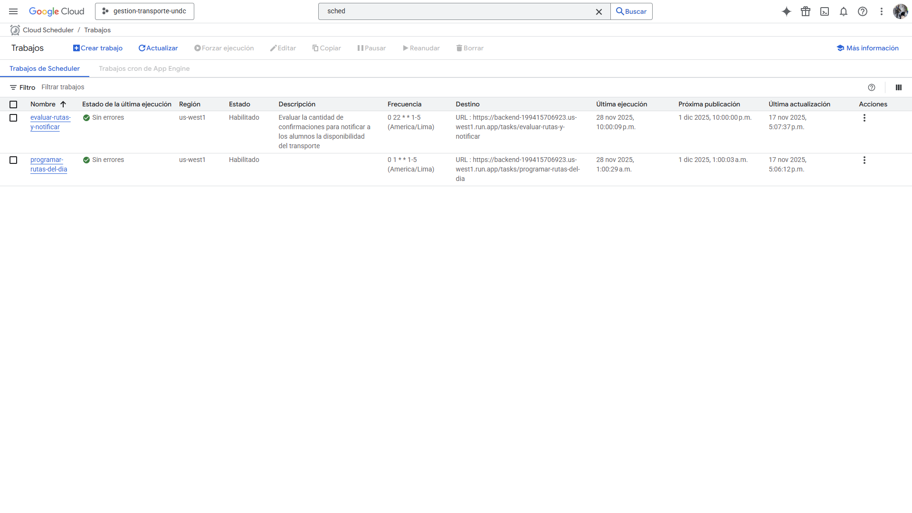
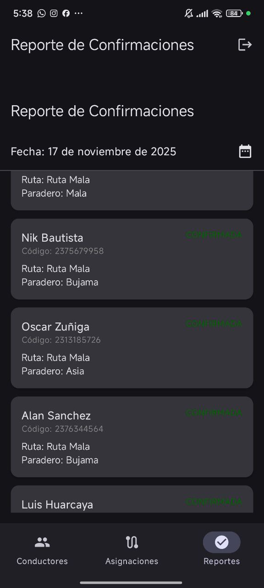
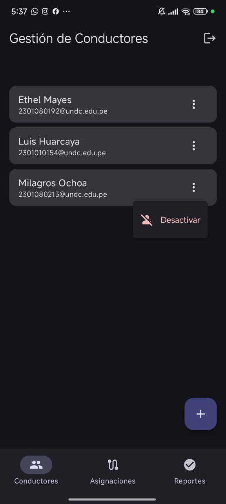
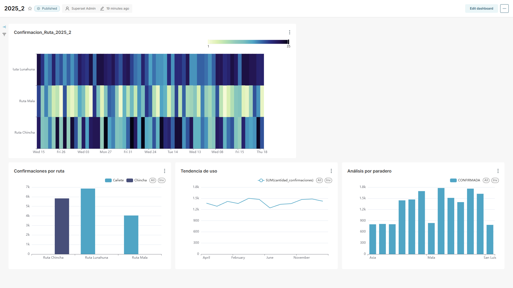

## El Reto: La Incertidumbre del Transporte Nocturno

La universidad enfrentaba un dilema logístico diario: los autobuses de las tres rutas nocturnas solo podían operar si se confirmaba un mínimo de 15 estudiantes. El método existente —encuestas y mensajes desorganizados en grupos de WhatsApp— era caótico. La información se perdía, generando incertidumbre para todos:

*   **Estudiantes:** No sabían si tendrían transporte seguro para volver a casa.
*   **Conductores y Coordinadores:** No podían planificar sus operaciones eficientemente.
*   **Administración:** Carecía de datos fiables para tomar decisiones.

La solución debía ser accesible para todos los estudiantes, considerando que no todos disponen de un plan de datos para usar una app, pero WhatsApp es prácticamente universal. El objetivo era claro: **automatizar la confirmación de asistencia para tomar decisiones basadas en datos en tiempo real.**

## Mi Solución: Un Ecosistema Automatizado

Como único desarrollador, diseñé y construí un ecosistema integral desde cero para resolver este problema, orquestando varias tecnologías para crear un flujo de información coherente y automatizado.

<!-- Aquí puedes añadir un diagrama de flujo de datos o de secuencia para dar más detalle. -->

El sistema se compone de cuatro pilares:

1.  **Bot de Confirmación (WhatsApp):** El punto de contacto principal para los estudiantes, permitiéndoles confirmar su necesidad de transporte de forma sencilla y directa.
2.  **Backend Principal (Flask):** El cerebro del sistema, responsable de la lógica de negocio y la orquestación de tareas. [Ver código en GitHub](https://github.com/mercer2511/sistema-transporte-universitario).
3.  **App Móvil de Operaciones (Kotlin Nativo):** Una herramienta para que los conductores y coordinadores visualicen en tiempo real las listas de pasajeros. [Ver código en GitHub](https://github.com/mercer2511/app-movil-bus-noche).
4.  **Dashboard de BI (Apache Superset):** Provee a la administración dashboards visuales con KPIs clave. [Ver Demo en Vivo](https://apache-superset-199415706923.us-west1.run.app/) (Usuario: `visitante@prueba.com`, Contraseña: `123456`).

## Decisiones Clave de Arquitectura

Cada elección tecnológica se basó en la eficiencia, el costo y los requisitos del mundo real.

### 1. Microservicios con Propósito: Flask y FastAPI

En lugar de un backend monolítico, separé las responsabilidades. Usé **FastAPI** para crear un [microservicio de validación](https://github.com/mercer2511/ValidacionAlumno) aislado. Su única función es simular la verificación de la identidad del estudiante, garantizando que, por diseño, **no se almacene información personal sensible**. El backend principal, construido con **Flask**, se encarga de toda la lógica de negocio restante.

### 2. La Magia de la Automatización: Google Cloud Tasks

La funcionalidad más potente del sistema son las tareas programadas (`time schedules`) que orquestan el flujo diario sin intervención manual:
*   **Inicio del día:** Una tarea inicializa las rutas activas.
*   **Cierre de confirmaciones:** A las 10:00 PM, una tarea cuenta las confirmaciones, decide si el servicio se activa y notifica a los involucrados.
*   **Sincronización de BI:** Semanalmente, un proceso ETL migra los datos para el análisis en Superset.

Todo esto se despliega en **Google Cloud Run**, permitiendo que los contenedores se activen solo bajo demanda, optimizando drásticamente los costos.

### 3. Pragmatismo en la App Móvil: Kotlin Nativo

La app móvil está destinada a dispositivos de bajo costo que se comprarían específicamente para los conductores. Elegí **Kotlin Nativo** porque el desarrollo para Android representaba un menor costo de hardware y me daba control total sobre el rendimiento.

## Desafíos Técnicos y Aprendizajes

*   **La Trampa del Huso Horario:** Los servidores en la nube operan en UTC, mientras que el servicio es en Lima (UTC-5). Esto causaba conflictos en las tareas programadas. La solución fue establecer la base de datos como la única fuente de verdad para el tiempo y realizar todas las transformaciones de zona horaria en la capa de aplicación.

*   **BI con Presupuesto Cero:** El requisito inicial era Power BI, pero su costo era una barrera. Propuse **Apache Superset** como una alternativa open-source y auto-alojada, cumpliendo con el requisito sin impactar el presupuesto.

*   **Priorización y "Trade-Offs":** Para cumplir con la fecha de entrega del dashboard de BI, tomé la decisión consciente de sacrificar la estética de la interfaz de la app móvil, enfocándome primero en la funcionalidad crítica.

## Mi Rol e Impacto

Como **único desarrollador**, mis responsabilidades abarcaron todo el ciclo de vida del proyecto:
*   **Arquitectura de la solución y elección del stack tecnológico.**
*   **Desarrollo completo del backend y los microservicios.**
*   **Creación de la aplicación móvil en Kotlin.**
*   **Configuración de la infraestructura en Google Cloud y la base de datos en Neon.**
*   **Implementación del pipeline de datos y los dashboards de BI.**

Aunque el proyecto es un prototipo, el feedback inicial fue muy positivo. Los usuarios valoraron la **automatización de las notificaciones** y la claridad que ahora tienen los conductores al poder ver una **lista de pasajeros y paraderos en tiempo real**. Personalmente, mi mayor orgullo es haber diseñado una solución enfocada en la viabilidad económica y la resolución de un problema real, considerando siempre el costo y el impacto de cada decisión técnica.
